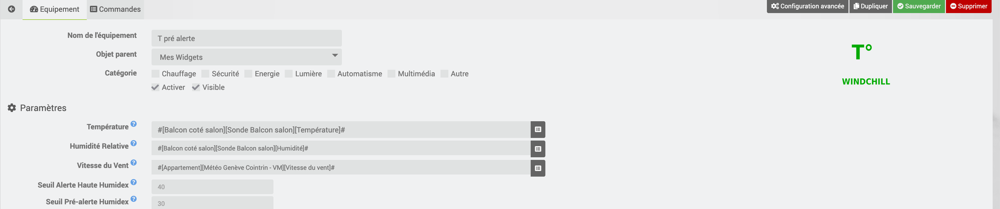
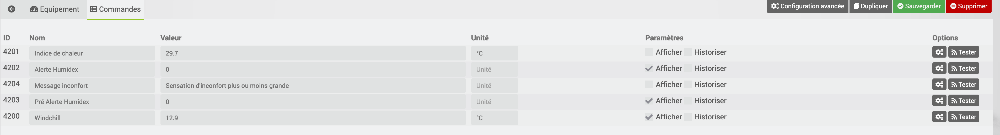

# Description

Ce plugin permet de calculer l'effet du vent sur la température ressentie, windchill (plutôt lorsque les températures sont basses), ainsi que l'effet d'incofort provoqué par le taux d'humidité lorsque les températures sont élevées (humidex).

# Configuration

Le plugin ne comporte pas de configuration générale.
Il faut ajouter des équipements pour la température, l’humidité et la vitesse du vent
Il est possible d'indiquer :
- Un seuil d'alerte pour l'indice de chaleur (HUMIDEX). Par défaut c'est 40°C qui déclenche l'alerte
- Un seuil de pé-alerte pour l'indice de chaleur (HUMIDEX). Par défaut c'est 30°C qui déclenche la préalerte

# Exemple de configuration

Voici un exemple de configuration

# FAQ

-   **Est-ce que le plugin s'appuie sur des API tiers ?**

>Non, le plugin fait le calcul en interne par rapport à la température, l’humidité et la vitesse du vent

-   **Refroidissement éolien (ou indice Windchill), kesako ?**

>Le refroidissement éolien, parfois aussi appelé facteur vent, ou windchill désigne la sensation de froid produite par le vent, alors que la température réelle de l'air ambiant ne s'abaisse pas.

-   **Et l'indice de chaleur ou humidex ?**

>L’indice de chaleur (nom original en anglais Heat Index (HI) ou humiture) est un indice développé aux États-Unis. Il combine la température de l'air ambiant et l'humidité relative, dans des zones ombragées, pour tenter de déterminer la perception de la température que ressent le corps humain, c'est-à-dire de combien il ressentirait la chaleur si l'hygrométrie était à une autre valeur à l'ombre. Le résultat est également connu comme la « température ressentie à l'air » ou « la température apparente ». Par exemple, quand la température est de 32°C (ou 90°F) avec 70 % d'humidité relative, l'index de chaleur est alors de 41°C (ou 106°F). Cette température d'index de chaleur a une humidité implicite (non spécifiée) de 20 %. C'est la valeur de l'humidité relative pour laquelle la formule d'index de chaleur indique que 41°C est ressentie comme 41 °C. Une température d'index de chaleur de 32°C a une humidité relative implicite de 38 %.
>L’indice de chaleur est basé sur la capacité du corps humain à refroidir la peau par la production de sueur. Celle-ci s'évapore dans l'air ce qui nécessite de l'énergie qui est prise au milieu et baisse la température de la couche limite touchant à la peau, donnant une sensation de fraîcheur. En augmentant, l'humidité relative de l'air, l'évaporation se fait moins bien et donne une sensation subjective de chaleur accrue. Cet indice ne doit pas être confondu avec le facteur humidex canadien qui utilise une autre formule pour quantifier le même effet.

# Troubleshotting

> **Je n'ai pas d'informations qui remontent**
>
>Il faut bien indiquer un équipement température, humidité et vitesse de vent pour que le plugin fonctionne correctement.
>On peut rechercher les équipements grace au bouton de recherche de l’équipement